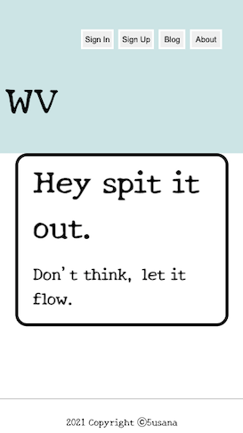
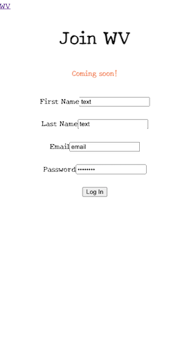

# WV Word Vomit Blog app

### Project 4 for General Assembly's remote Software Engineering Immersive program

> Word Vomit is a one liner blog to document events most worthy of remembrance. It's satisfying being able to look back on your accomplishments, even defeats, and memories in-between but the thought of writing out a whole page is daunting. Here you are encouraged to write out your thoughts, of the day in only a line or so without the pressure of filling out an entire page.

# User stories
> As a new/inspired blogger, I want the ease of documenting my thoughts without the pressure of writing an entire blog

> As a new/inspired blogger, I would like to see my entries both individually and in a log.
# ScreenShots

### Landing Page

### Blog Page

### Create/Pubish Entry

### About Page

### SignUp page

### SignIn page

# The Approach Taken

# Features

### Landing Page

### Blog

### Create Posting

### Modify Posting

### Delete Posting

### About Page

### Sign Up Page

### Sign In Page

# Technologies Used

- MERN

### Organization / Guidance

- Discord
- Slack
- Zoom
- Google Docs

### Design

- Figma

### Development

- VS Code, CodeSandbox
- Google Chrome + Developer Tools
- Mozilla Firefox + Developer Tools
- HTML
- CSS Grid, CSS Flexbox
- React.js, React Router, React Styled-Components

# Getting Started/Installation Instructions

This project was bootstrapped with [Create React App](https://github.com/facebook/create-react-app).

# Contribution Guidelines
The contribution process currently relies on some knowledge of working with Github and writing in Markdown. Here are some resources/helpful links to understand both: 
- [Chaser Pettit's introduction to the GitHub workflow](https://gist.github.com/Chaser324/ce0505fbed06b947d962)
- [Basic Markdown Syntax](https://www.markdownguide.org/basic-syntax/)

Requests to contribute (contribute to your code, identify bugs, and/or propose improvements) can be made via [pull request](https://github.com/big-brainers/boat-frontend/compare) or [issue](https://github.com/big-brainers/boat-frontend/issues/new/choose). Thank you!

### References/Credits:
https://storybook.js.org/
https://storybook.js.org/tutorials/intro-to-storybook/
https://git.generalassemb.ly/SEIR-201/react-intro
https://git.generalassemb.ly/SEIR-201/react-router
https://dev.to/kingdavid/learn-react-hook-by-building-a-simple-blog-app-22i2
https://ibaslogic.com/how-to-add-hamburger-menu-in-react/
https://codersera.com/blog/reactjs-projects-for-beginners/
https://git.generalassemb.ly/SEIR-201/react-hooks
https://git.generalassemb.ly/SEIR-201/react-state-and-props
https://developer.mozilla.org/en-US/docs/Web/JavaScript/Reference/Operators/Spread_syntax
https://help.heroku.com/FZDDCBLB/how-can-i-download-my-code-from-heroku
https://developer.mozilla.org/en-US/
https://www.w3schools.com/
https://styled-components.com/
## Available Scripts

In the project directory, you can run:

## Acknowledgments
GA Instructors for the SEIR-201 course and our extremely supportive cohort

### `npm start`

Runs the app in the development mode.\
Open [http://localhost:3000](http://localhost:3000) to view it in the browser.

The page will reload if you make edits.\
You will also see any lint errors in the console.

### `npm test`

Launches the test runner in the interactive watch mode.\
See the section about [running tests](https://facebook.github.io/create-react-app/docs/running-tests) for more information.

### `npm run build`

Builds the app for production to the `build` folder.\
It correctly bundles React in production mode and optimizes the build for the best performance.

The build is minified and the filenames include the hashes.\
Your app is ready to be deployed!

# Unsolved Problems

The Sign in & Sign up components are not functioning yet. I would like to continue working on getting these up along with a backend so the blog postings can be saved.

### References/Credits:

https://www.udemy.com/course/the-complete-web-development-bootcamp/
https://www.freepik.com/vectors/background
https://fonts.google.com/specimen/Inconsolata?preview.text_type=custom
https://avataaars.com/
https://favicon.io/favicon-converter/
